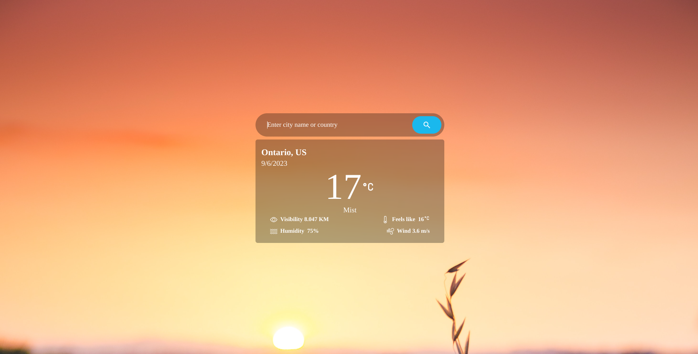
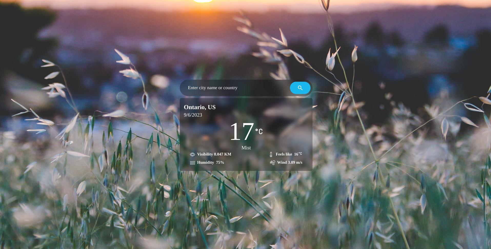
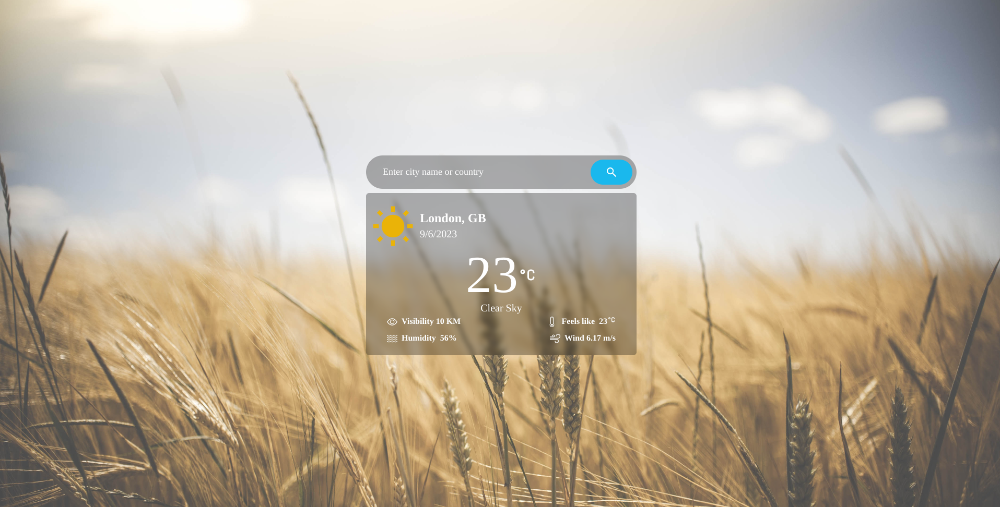

# Weather app
Simple Weather app created with the Openweather api with changing background

# To Run 
first clone the repo by ```git clone git@github.com:shishirchhetri/weather-app.git```
Open in your editor then open terminal and run 
```npm install```
    or
```yarn install```

then finally ```npm run dev```

# some snaps:





