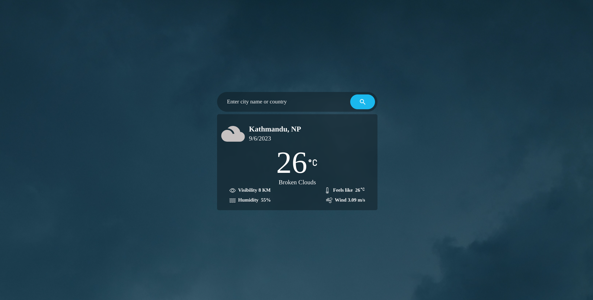

# Weather app
Simple Weather app created with the Openweather api with changing background

# To Run 
first clone the repo by <br/> <br/>
```git clone git@github.com:shishirchhetri/weather-app.git``` <br/> <br/>
Open in your editor then open a terminal and run <br/> <br/>
```npm install```<br/>
    or <br/>
```yarn install``` <br/> <br/>

then finally <br/>
```npm run dev```

# Live Demo
https://shishirchhetri-weather-app.netlify.app/

# some snaps:



